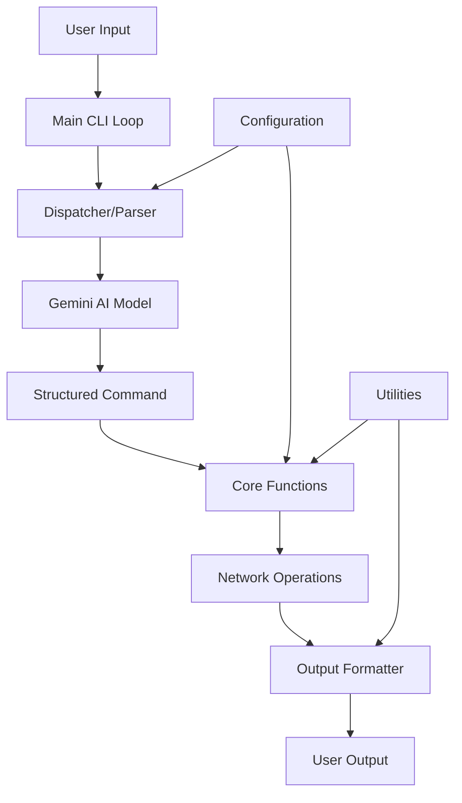

# Design Document

## Overview

The Network CLI Assistant is a Python-based command-line application that bridges natural language input with structured network operations. The system leverages Google's Gemini AI model to parse user intent and translate it into function calls for network tasks like SSH command execution, ACL generation, and network diagnostics.

The architecture follows a modular design with clear separation of concerns: natural language processing, command dispatch, function execution, and output formatting. The current implementation provides a solid foundation with core networking functions and an AI-powered dispatcher.

## Architecture

### High-Level Architecture



### Component Architecture

The system is organized into five main components:

1. **Main Entry Point** (`main.py`) - CLI loop and orchestration
2. **Dispatcher** (`dispatcher.py`) - Natural language processing and command parsing
3. **Core Functions** (`core_functions.py`) - Network operation implementations
4. **Configuration** (`config.py`) - Settings and credential management
5. **Utilities** (`utils.py`) - Helper functions and formatting

### Data Flow

1. User enters natural language command
2. Main loop captures input and passes to dispatcher
3. Dispatcher sends input to Gemini AI with function specifications
4. AI returns structured JSON command with function name and arguments
5. Main loop executes the specified core function with provided arguments
6. Function performs network operation and returns structured result
7. Output formatter presents results in human-readable format
8. User receives formatted output with suggestions for next steps

## Components and Interfaces

### Main CLI Loop (`main.py`)

**Responsibilities:**
- Initialize application and display welcome message
- Manage interactive command loop
- Coordinate between dispatcher and core functions
- Handle user exit commands and interrupts
- Error handling for invalid functions or arguments

**Key Interfaces:**
```python
def main() -> None
    # Main application entry point
```

### Dispatcher (`dispatcher.py`)

**Responsibilities:**
- Generate dynamic prompts with current function specifications
- Interface with Gemini AI model for natural language processing
- Parse AI responses into structured command dictionaries
- Handle AI API errors and fallbacks

**Key Interfaces:**
```python
def parse_command(user_input: str) -> dict
    # Returns: {"function": str, "args": dict}

def get_prompt() -> str
    # Dynamically generates AI prompt with available functions
```

**AI Integration:**
- Uses Google Gemini 1.5 Flash model for cost-effective processing
- Dynamic prompt generation includes all available core functions
- Handles incomplete hostnames by inferring common TLDs
- Returns structured JSON for reliable parsing

### Core Functions (`core_functions.py`)

**Current Functions:**
- `run_command(host: str, cmd: str) -> dict` - SSH command execution (placeholder)
- `generate_acl(src_ip: str, dst_ip: str, action: Literal["permit", "deny"]) -> dict` - ACL generation
- `ping(host: str) -> dict` - ICMP ping operations
- `traceroute(host: str) -> dict` - Network path tracing
- `dns_lookup(host: str) -> dict` - DNS resolution
- `run_nmap_scan(target: str, top_ports: int = 10) -> dict` - Port scanning
- `run_netstat() -> dict` - Local port listing

**Function Interface Pattern:**
```python
def function_name(param1: type, param2: type = default) -> dict:
    """
    Function description for AI prompt generation.
    
    Args:
        param1: Parameter description
        param2: Parameter description with default
        
    Returns:
        dict: {"success": bool, "output": any, "error": str}
    """
```

### Configuration Management (`config.py`)

**Responsibilities:**
- Load configuration from secure sources (environment variables, config files)
- Manage SSH credentials and connection parameters
- Validate configuration settings
- Provide secure access to sensitive information

**Planned Enhancements:**
- YAML/TOML configuration file support
- SSH key management
- Server inventory management
- API key rotation

### Utilities (`utils.py`)

**Current Utilities:**
- `validate_ip(ip_address: str) -> bool` - IP address validation
- `format_output(data: dict) -> str` - Human-readable output formatting

**Output Formatting Strategy:**
- Success indicators with checkmarks and error symbols
- Structured data presentation with JSON formatting
- Error message clarity and troubleshooting hints
- Consistent formatting across all function outputs

## Data Models

### Command Structure

```python
{
    "function": str,        # Name of core function to execute
    "args": {              # Function arguments as key-value pairs
        "param1": value1,
        "param2": value2
    }
}
```

### Function Response Structure

```python
{
    "success": bool,       # Operation success indicator
    "output": any,         # Function-specific output data
    "error": str,          # Error message if success is False
    "stdout": str,         # Standard output (for command execution)
    "stderr": str,         # Standard error (for command execution)
    "exit_code": int       # Exit code (for command execution)
}
```

### Configuration Schema

```python
{
    "ssh_user": str,           # Default SSH username
    "ssh_key_path": str,       # Path to SSH private key
    "gemini_api_key": str,     # Gemini AI API key
    "default_timeout": int,    # Network operation timeout
    "server_inventory": [      # Known server list
        {
            "name": str,
            "host": str,
            "description": str
        }
    ]
}
```

## Error Handling

### Error Categories

1. **Input Validation Errors**
   - Invalid IP addresses
   - Malformed commands
   - Missing required parameters

2. **Network Operation Errors**
   - SSH connection failures
   - DNS resolution failures
   - Network timeouts

3. **AI Processing Errors**
   - API rate limiting
   - Invalid JSON responses
   - Model unavailability

4. **System Errors**
   - Missing dependencies
   - Permission issues
   - Configuration problems

### Error Handling Strategy

- **Graceful Degradation**: Continue operation when possible
- **Clear Error Messages**: Provide actionable error information
- **Logging**: Record errors for debugging without exposing sensitive data
- **Retry Logic**: Implement exponential backoff for transient failures
- **Fallback Mechanisms**: Provide alternative approaches when primary methods fail

## Testing Strategy

### Unit Testing

**Core Functions Testing:**
- Mock network operations to avoid external dependencies
- Test input validation with edge cases
- Verify output format consistency
- Test error handling scenarios

**Dispatcher Testing:**
- Mock Gemini AI responses
- Test JSON parsing edge cases
- Verify prompt generation accuracy
- Test error recovery mechanisms

**Utilities Testing:**
- IP validation with various formats
- Output formatting with different data types
- Configuration loading and validation

### Integration Testing

**End-to-End Workflows:**
- Complete user input to output cycles
- AI integration with real API calls
- Network function integration with controlled environments
- Configuration loading and application

### Security Testing

**Input Sanitization:**
- Command injection prevention
- IP address validation
- SSH parameter sanitization

**Credential Security:**
- Environment variable handling
- SSH key security
- API key protection

### Performance Testing

**Response Time:**
- AI processing latency
- Network operation timeouts
- Large output handling

**Resource Usage:**
- Memory consumption with large outputs
- CPU usage during AI processing
- Network bandwidth utilization

## Security Considerations

### Input Sanitization

- All user inputs are validated before processing
- IP addresses validated using Python's `ipaddress` module
- Command parameters sanitized to prevent injection attacks
- SSH commands constructed using parameterized approaches

### Credential Management

- API keys loaded from environment variables
- SSH credentials stored securely outside source code
- Configuration files with appropriate file permissions
- No sensitive data in logs or error messages

### Network Security

- SSH connections use key-based authentication
- Network operations have configurable timeouts
- ACL generation validates IP ranges and formats
- Remote command execution limited to safe operations

### Data Privacy

- User inputs not logged with sensitive information
- Network scan results handled securely
- Error messages sanitized to prevent information disclosure
- AI API interactions logged without sensitive context

## Extensibility Design

### Adding New Functions

The architecture supports easy addition of new network functions:

1. **Function Implementation**: Add function to `core_functions.py` following the standard interface pattern
2. **Automatic Discovery**: Dispatcher automatically includes new functions in AI prompts
3. **Documentation Integration**: Function docstrings become part of AI training context
4. **Testing Integration**: New functions follow established testing patterns

### AI Model Flexibility

- Gemini AI integration abstracted through dispatcher interface
- Model selection configurable through environment variables
- Prompt engineering separated from core logic
- Support for multiple AI providers through adapter pattern

### Configuration Extensibility

- Plugin-style configuration for new function categories
- Server inventory management for known hosts
- Custom command aliases and shortcuts
- User preference storage and retrieval